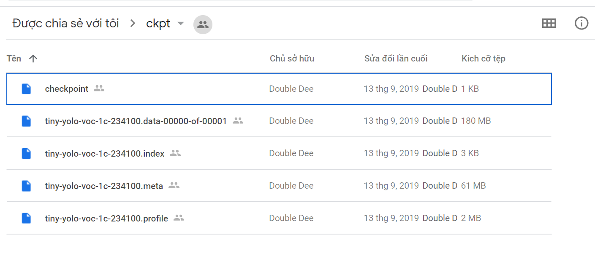

# ITS (Intelligent Traffic System) là gì?
[](/)

ITS là hệ thống phân tích giao thông bao gồm các thành phần:
|  | Tên thành phần | Link |
| ------ | ------ | ------ |
| 1 | Phân tích lưu lượng giao thông | [link!](https://github.com/xinchaothegioi31415/ITS-Traffic-Capacity-Analyzation) |
| 2 | Nhận diện tai nạn giao thông | here! |
| 3 | Công nghệ phát hiện vượt đèn đỏ | [link!](https://github.com/xinchaothegioi31415/Red-Light-Detection) |

>Hệ thống sử dụng công nghệ Machine Learning thông qua thư viện mã nguồn mở Darkflow để huấn luyện cho máy tính.
>Ngoài ra, hệ thống còn sử dụng thư viện mã nguồn mở OpenCV để phân tích hình ảnh.

# Accident Regconition Machine Learning (ARML)
**"Công nghệ nhận diện tai nạn giao thông" (ARML)** được xây dựng dựa trên **[Darkflow](https://github.com/thtrieu/darkflow)** - Một dự án mã nguồn mở hỗ trợ người dùng sử dụng thư viện YOLO và công nghệ Tensorflow (Google) để "huấn luyện" và nhận dạng vật thể.
ARML được ứng dụng để xây dựng **chương tình phát hiện tại nạn giao thông** bằng hình ảnh.
")
# 🤖 Dependencies & Download
| | Tên | 🌐 Tải xuống | ⚠Chú ý|
|-|-|-|-|
|1|VS2019 Community|[Download](https://visualstudio.microsoft.com/vs/community/)|Cài đặt workload **Desktop Dev with C++**|
|2|Anaconda 3|[Download](https://repo.anaconda.com/archive/)|Chọn **Add to PATH** để cài đặt môi trường python|
|3|CUDA 10.0|[Download](https://developer.nvidia.com/cuda-10.0-download-archive)||
|4|cuDNN 7.6.4 (for CUDA 10.0)|[Download](https://developer.nvidia.com/compute/machine-learning/cudnn/secure/7.6.4.38/Production/10.0_20190923/cudnn-10.0-windows10-x64-v7.6.4.38.zip) [Archive](https://developer.nvidia.com/rdp/cudnn-archive)|
|5|opencv-python (4.1.1.26)|😐|*Hướng dẫn cài đặt ở bên dưới!*|
|6|tensorflow-gpu (1.15.0)|😐|//|
|7|numpy (1.16.3)|😐|//|
|8|pyrebase4|😐|//|
# 🦉 Hướng dẫn cài đặt 
>Trong dự án này có sử dụng CUDA và cuDNN, là 2 thư viện được phát triển dành riêng cho các dòng GPU thuộc hãng NVIDIA. Các dòng GPU thuộc hãng khác sẽ có các thư viện hỗ trợ riêng và có thể sẽ không tương thích với dự án này. Bạn có thể tìm hiểu một số GPU của NVIDIA **[tại đây!](https://en.wikipedia.org/wiki/List_of_Nvidia_graphics_processing_units)**
### Cài đặt VS2019
Chạy *Visual Studio Installer* vừa cài đặt ở trên, chọn workload **Desktop Development with C++** rồi tiến hành cài đặt.

### Cài đặt Anaconda 3
Sau khi tải Anaconda 3 theo đường link đã được cung cấp, cài đặt như bình thường, chú ý ở bước sau:

### CUDA & cuDNN và thiết lập môi trường (PATH)
Tiến hành theo các bước sau:
1. Tải CUDA và cài đặt như bình thường.
2. Tải cuDNN và giải nén, ta được folder ***"cuda"***
3. Copy thư mực ***"cuda"*** vào ổ đĩa C:\\, khi đó ta sẽ có được đường dẫn của folder là ***"C:\\cuda\\"***
4. Mở Run, nhập: `powershell -command "&{start-process rundll32.exe sysdm.cpl,EditEnvironmentVariables -verb RunAs}
`
5. Ở phần *System Variables*, chọn **Path** và nhấn `Edit...`

6. Bấm `New` và thêm vào 4 dòng sau đây:  

    ```sh
    C:\Program Files\NVIDIA GPU Computing Toolkit\CUDA\v10.0\bin
    C:\Program Files\NVIDIA GPU Computing Toolkit\CUDA\v10.0\include
    C:\Program Files\NVIDIA GPU Computing Toolkit\CUDA\v10.0\extras\CUPTI\libx64
    C:\cuda\bin
    ```

# 🐦 Setup dự án
**Bước 1:** Trước tiên, cần clone dự án về máy tính thông qua 2 cách sau:
1. Sử dụng Git:
    ```sh
    $ git clone https://github.com/xinchaothegioi31415/Accident-Regconition-ML.git
    ```
2. Hoặc tải trực tiếp ở dạng file nén ZIP:  
    

> ***Chú ý***: Tải **thư mục ckpt** đã được training **[tại đây!](https://bit.ly/its_training)**, ***ghi đè thư mục mới này lên thư mục cũ bên trong folder của dự án***.


**Bước 2**: Mở **"cmd"** và dẫn tới thư mục dự án, nhập dòng lệnh sau vào cmd để build dự án:
```sh
$ python setup.py build_ext --inplace
```

**Bước 3**: Cài đặt các thư viện cần thiết bằng cách nhập dòng lệnh sau vào cmd:
```sh
$ pip install -r requirement.txt
```

**Bước 4**: Nhập dòng lệnh sau để tiến hành khởi chạy:
```sh
$ python accidents_detection.py
```
***
Happy Coding! 💻
